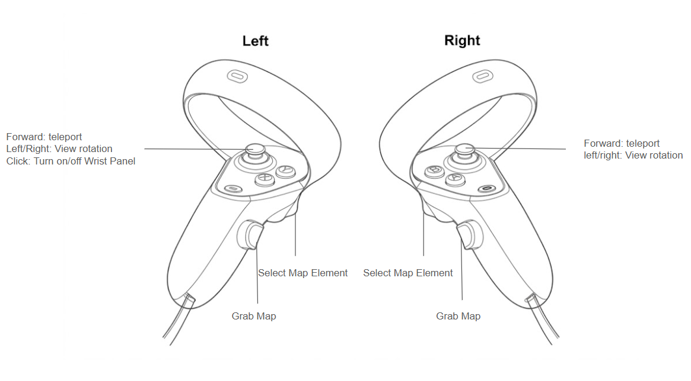

# FAA Prototype Workspace

This repository is organized around the runnable FAA prototype under [`prototype/`](./prototype). The VR viewer, the 2D review app, shared browser modules, rebuild tools, and the staged runtime data all live there.

## Canonical Structure

```text
prototype/
  babylon-vr-faa-map/   # VR viewer, launch scripts, runtime data
  faa-2d-map/           # 2D linked review companion
  shared/               # shared browser modules for linking and section loading
  tools/                # Python rebuild/export scripts
  reference-data/       # local-only FAA source datasets and GeoTIFF inputs
  outputs/              # generated analysis/export artifacts
  research/             # notes, debug imagery, and non-runtime scratch work
```

## Clone and run

Prerequisite for the launcher scripts:

- Install Windows Node.js LTS from [nodejs.org](https://nodejs.org/)

Recommended fresh-clone path:

```powershell
git clone https://github.com/hehegg123/VFR-VR-Training-map.git
cd .\VFR-VR-Training-map
.\launch-demo.cmd
```

If you prefer the original launcher file with spaces in its name, use:

```powershell
& ".\Launch St. Louis Demo.cmd"
```

That one-click launcher:

- starts the linked-review session over HTTPS
- opens a lightweight local operator page
- shows the LAN VR URL for the headset browser
- shows the LAN desktop/2D companion URL
- gives you a `Stop Session` button

The checked-in runtime data is enough to launch immediately after cloning.
That includes the staged Daytona and St. Louis runtime assets under `prototype/babylon-vr-faa-map/data/sections/`.

If you want the direct non-wrapper launch paths instead:

- linked desktop review:

```powershell
cd .\prototype\babylon-vr-faa-map
powershell -ExecutionPolicy Bypass -File .\scripts\launch_stlouis_linked_review.ps1
```

- VR-only desktop review:

```powershell
cd .\prototype\babylon-vr-faa-map
powershell -ExecutionPolicy Bypass -File .\scripts\launch_stlouis_prototype.ps1
```

- HTTPS or headset review:
  - `prototype\babylon-vr-faa-map\scripts\launch_stlouis_linked_review_https.ps1`
  - `prototype\babylon-vr-faa-map\scripts\launch_stlouis_hmd_demo.ps1`

## Rebuild Assets

The checked-in runtime data under `prototype/babylon-vr-faa-map/data/` is enough to run the prototype after cloning. Rebuilding those assets requires local FAA source datasets and the source chart GeoTIFFs under `prototype/reference-data/`.

Rebuild command:

```powershell
py -3 .\prototype\babylon-vr-faa-map\tools\build_section_assets.py
```

## VR controls



The diagram shows the current left- and right-controller mappings used by the VR application.

Current VR controls:

- `Enter VR`: starts immersive VR when WebXR is available.
- `Controller ray`: point at labels or controls and press/select to interact.
- `Left forearm panel`: the in-VR control panel appears above the left front arm.
- `Thumbstick / stick click`: toggles the in-VR control panel on and off.
- `Map` toggle: shows or hides a layer.
- `Labels` toggle: shows or hides labels for a layer.
- `Altitude` toggle: for the airspace layer only, switches between flat selection and the proxy altitude-volume view.
- `One-hand squeeze / grab`: drags the map in space.
- `Two-hand squeeze / grab`: moves, scales, and rotates the map together.
- `Label selection`: labels are preferred pick targets over geometry beneath them.

Current default section behavior:

- The prototype now opens into the `Daytona Beach Area` section by default.
- `St. Louis Sectional` remains available from the in-app section selector.

Current behavior notes:

- The panel uses Babylon XR pointer interaction, so exact controller button names can vary slightly by headset/browser.
- If a controller does not expose a squeeze component, the manipulator falls back to trigger-style grab input where available.
- The initial VR pose is set so the user starts in front of the map and can look down over it.
- For HMD/WebXR use, the headset browser must trust the generated dev certificate if it does not already.

## Instruction sets for researchers

Instruction sets are editable JSON files under `prototype/training/task-sets/<section-id>/`. To add one:

1. Create `<task-set-id>.json` using schema `faa-vr-task-set-v1`. Define the matching `id`, `sectionId`, title, and one or more manual-completion tasks.
2. Give each task an ID, title, instructions, optional recommended layer IDs, and optional targets containing a staged `layerId` and `selectionId`.
3. Run `py -3 .\prototype\babylon-vr-faa-map\tools\stage_task_sets.py <section-id>` to validate and stage task files without rebuilding map rasters. A full `build_section_assets.py` run performs the same task-set validation and staging as part of a section rebuild.
4. Launch the prototype and open the 2D companion. Choose the map section, choose the task set from `Instruction Set`, and start a linked session using the same Session ID as the VR app. The VR wrist panel then exposes its `Instructions` tab for reviewing and manually completing tasks.
5. Before a new participant, select `Reset Task Session` in the 2D companion. This disposes the old VR task session and starts the selected task set from its first task with no completed tasks.

Task progress and the research event log are held in memory only. Reloading the page starts a new session; no participant progress is written to browser storage. Logged events include task-set loading, instruction-tab opening, task views, previous navigation, task completion, task-set completion, and session clearing, with section and linked-session context when available. During a running page session, researchers can inspect or export a snapshot from the browser console with `faaInstructionResearch.getEvents()`.

## Event sets for researchers

Event sets are editable JSON files under `prototype/training/event-sets/<section-id>/`. Event objects use schema `faa-vr-event-set-v1`, are registered through `manifest.training.eventSets`, and are selected from the desktop companion. Static aircraft and weather events remain supported. An event set may also include a deterministic training `scenario` with timed aircraft routes, configured separation minimums, and predefined trainee actions.

The first event types are `aircraft` and `weather`. Aircraft events can define normalized `position`, optional `orientation.headingDeg`, and optional `altitude.valueFt` with `reference` set to `MSL` or `AGL`. Weather events can define a normalized circle or polygon geometry plus optional `altitude.baseFt`, `altitude.topFt`, and `reference`. Events without altitude still render with fallback training heights.

VR event altitude uses the same visual conversion as the airspace altitude overlay: `0.00008` world units per foot unless a section manifest overrides `airspace.altitudeVolume.worldUnitsPerFoot`. The 2D companion stays flat but includes altitude text on event labels.

Animated scenarios must define `scenario.coordinateScale.widthNm` and `heightNm`. Horizontal separation converts normalized coordinate differences with `eastNm = deltaX * widthNm` and `southNm = deltaY * heightNm`, then calculates `sqrt(eastNm^2 + southNm^2)`. The Daytona conflict example uses a compressed `120 NM` by `96 NM` training scale. This scale makes scenario timing and separation deterministic; it is not a geodesic measurement of the displayed sectional chart. Conflict prediction samples the predefined trajectories every `0.5` scenario seconds through `alertLookaheadSec`.

### Conflict scenario format

The checked-in example is `prototype/training/event-sets/daytona/daytona-conflict-scenario.json`. Its essential structure is:

```json
{
  "schema": "faa-vr-event-set-v1",
  "id": "daytona-conflict-scenario",
  "sectionId": "daytona",
  "title": "Daytona Conflict Scenario",
  "scenario": {
    "durationSec": 90,
    "alertLookaheadSec": 30,
    "coordinateScale": { "widthNm": 120, "heightNm": 96 },
    "separation": { "horizontalNm": 5, "verticalFt": 1000 },
    "actions": [
      {
        "id": "flight-a-turn-right-130",
        "type": "turnHeading",
        "aircraftId": "flight-a-eastbound",
        "headingDeg": 130
      },
      {
        "id": "flight-a-resume-route",
        "type": "resumeRoute",
        "aircraftId": "flight-a-eastbound"
      }
    ]
  },
  "events": [
    {
      "id": "flight-a-eastbound",
      "type": "aircraft",
      "defaultEnabled": true,
      "route": {
        "points": [
          { "timeSec": 0, "position": { "x": 0.35, "y": 0.52 }, "altitude": { "valueFt": 35000, "reference": "MSL" } },
          { "timeSec": 45, "position": { "x": 0.535, "y": 0.52 }, "altitude": { "valueFt": 35000, "reference": "MSL" } }
        ]
      }
    }
  ]
}
```

Each animated aircraft needs at least two route points ordered by `timeSec`. Positions are normalized map coordinates, altitudes are feet, and headings are degrees clockwise from north. Scenario IDs, event IDs, action targets, route times, coordinates, altitude fields, and separation settings are validated by both the Python staging contract and `EventSetRepository` at runtime.

After editing an event set, validate and stage it with:

```powershell
py -3 .\prototype\babylon-vr-faa-map\tools\stage_task_sets.py daytona
```

Despite its legacy filename, this command stages and validates both task sets and event sets. A full `build_section_assets.py` rebuild performs the same event-set staging.

### Running the Daytona scenario

1. Start the repository root `launch-demo.cmd` and open both the Daytona VR URL and Daytona 2D companion URL.
2. In both views, use the same Session ID and select `Start Link`. The current synchronization transport works between same-origin tabs on the same machine/browser profile.
3. In the desktop companion, choose `Daytona Conflict Scenario` under `Event Set`. The VR app owns the authoritative timeline and sends aircraft/status snapshots to the desktop view.
4. Select `Start`. The warning appears before the configured violation. During the warning, select `Flight A: Turn Right Heading 130.` from either view.
5. Wait for `Resolved`; `Resume Route` remains disabled until horizontal separation is restored and the aircraft are safely diverging. Select it to guide Flight A toward its remaining predefined route.
6. Select `Reset` from either view to restore time, routes, aircraft positions, headings, actions, and conflict state to the exact initial snapshot.

Static event sets remain independent of the scenario transport. Selecting `Daytona Basic Events` exposes the existing aircraft and weather checkboxes without starting a timeline.

### Prototype scope and extensions

This is an educational visualization prototype, not an operational ATC simulator. The current scenario deliberately uses straight-line interpolation, an instantaneous heading assignment, a simplified route-rejoin path, a compressed normalized-coordinate scale, and configurable training separation values. It does not model aircraft performance, wind, pilot response, surveillance uncertainty, regulatory separation rules, or operational conflict-probe behavior.

Current limitations:

- Conflict evaluation is scoped to the first two scenario aircraft.
- Linked scenario synchronization uses browser `BroadcastChannel`; it does not synchronize a desktop and a standalone headset on different devices.
- Scenario progress is in memory and resets on reload.
- Commands are predefined; there is no arbitrary heading entry, voice recognition, or automatic trainee scoring.
- Physical controller ergonomics and frame rate still require verification on each target HMD.

Future work should extend the existing seams rather than replace the MVP: add validated action types in `EventSetRepository.js` and `event_set_contract.py`, add flight behavior in `EventSession.js`, add visual variants in `EventOverlayLayer.js` and `MapCanvasView.js`, and replace the link transport only when cross-device synchronization becomes an explicit requirement.

## Notes

- `prototype/reference-data/`, `prototype/outputs/`, and `prototype/research/` are for local source material and working artifacts; they are ignored for repository cleanliness by default.
- Legacy root-level copies from the earlier flat workspace layout are also ignored so the repo can focus on the canonical `prototype/` structure.
